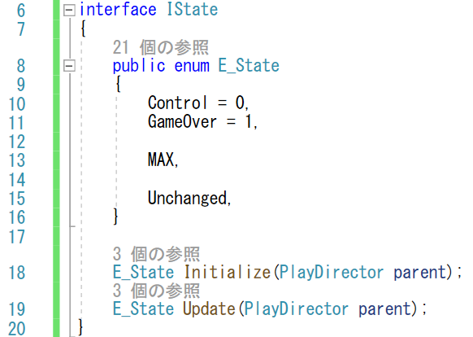

# 概要
今回は、ぷよが積みあがったらリスタートして、ずっと続けられるようにしてみます。

https://user-images.githubusercontent.com/936545/154944404-dded3aeb-fb9d-4a86-9983-a27b4af8955d.mp4

# 手順
## ステートの導入
今回、リスタートできるようにしますが、考え方としては「ゲームオーバー」を導入します。
ゲームがゲームオーバーになったらまた新しくゲームを始めます。
これは、ゲームを操作している状態とゲームオーバーの状態に交互になっていると考えられます。

状態と言えば、ステートパターンです。
現在の段階では大げさにも見えますが、ステートパターンを実装してみることにします。

ステートパターンは、ステートの共有のインターフェイスを用意して、
現在の状態に応じて、利用するクラスを切り替えることで、
状態間の依存性なく処理を記述していきます。

C# では、インターフェイスが用意されているので、
大本の状態をインターフェイスで記述していきましょう。

今回は、PlayDirector.csだけを更新します。

状態毎に呼び出される処理は、2つ用意したいと思います。

- 初期化: Initialize(18行目)
- 更新: Update(19行目)

このIStateインターフェイスに、どのような状態があるのかも記載しました。

- Control: ゲームをプレイしている状態 (10行目)
- GameOver: ゲームオーバーの状態 (11行目)

また、状態の数をMAXで自動定義して、検証に用いることができるようにします(13行目)。

あと、Unchanged状態を定義しています(15行目)。これは、状態が更新されなかったことを示す状態の値で、後から状態の遷移の判断で出てきます。

### 操作状態
具体的な状態はIStateインターフェイスを派生して作成します。
IStateインターフェイスと同名のメソッドを用意して、
その中に具体的な状態の中身を書いていきます。

例えば、ゲームを操作する状態を考えてみましょう。
いくつか考え方がありますが、最初にぷよをだしてみて、
出せなかったらゲームオーバー状態に遷移します。
ぷよが出せたら、ぷよを操作しますが、ぷよが下について固定されたら、
またControl状態をやり直せば良さそうです。

具体的なコードとしては、初期化処理でぷよを出して(88行目)、
その結果が失敗だったら(Spawnメソッドの返り値がfalseだったら)、
ゲームオーバー状態に遷移します(89行目)。
Spawnに成功したときは、初期化処理は正常に終えて、「Unchanged」を返します。

ぷよを出した後は、Updateメソッドでplayerオブジェクトの状態を監視しますが、playerオブジェクトが非アクティブになった時点で、状態を自分自身に推移しなおします(96行目)。

なお、今回は、具象Stateクラスで呼び出し元のPlayDirectorの
privateなメソッドやメンバーを使いたかったので、
PlayDirectorの内部クラスとして、ControlStateは定義しています
(PlayDirectorのクラス定義の中でControlStateを定義しています)。

但し、PlayDirectorのメソッドを直接呼び出すことはできないので、
各メソッドの引数として、PlayDirectorのインスタンスを渡しています。

### ゲームオーバー状態
なお、ゲームオーバーはもっと簡単です。
初期化時にシーンをリセットします。
シーンのリセットは、LoadSceneを呼び出します(103行目)。

LoadSceneを使う際は、「UnityEngine.SceneManagement」を使うことを宣言するのを忘れないようにしましょう(4行目)。

なお、InitializeもUpdateも実質的には何もしないので、
とりえあずUnchangedを返しています。

## ステートの更新
このように具体的なステートを作ったら、このステートを適切に呼び出して、
状態を切り替えられるようにしなくてはなりません。
今回は、ステートの配列をあらかじめ用意しておいて(34-37行目)、
現在の状態_current_state(33行目)の値に応じて、
使うステートのインスタンスを切り替えていきます。

初期化処理では、現在のステートの初期化関数を呼び出します(113行目)。
但し、初期化関数の返り値として、状態が変わるようであれば(115行目)、
状態を変えた後に、再び初期化関数を呼び出します(117-118行目)。
初期化関数で無限に状態を変え続けると、この処理が終わらずに、
スタックを使い果たしてしまう事だけ注意が必要です。

更新処理も同様に、更新関数を呼び出して(126行目)、
状態が変わるようであれば、初期化関数を呼び出していきます(127-132行目)。

共に、メソッドの最初で、状態が[0, E_State.MAX)の範囲内にあるか確認をして、おかしな状態が来たらわかるようにしています。

## ステートの呼び出し
後は、PlayDirectorの今までの処理を、ステートを使った処理に変えるだけです。

PlayDirectorの初期化処理であるStartメソッドでは、
直接ぷよを生み出していた部分をInitialStateの呼び出しに変更します(48行目)。

更新処理であるFixedUpdateメソッドでは、
キー入力の処理を終えた後に、状態の更新処理を回します(141行目)。

これらステートの処理の呼び出しは、今後、ステートの種類が増えたとしても、
書き換えることなく状態は拡張されます。

# 検証

ぷよが上に積みあがったら、また最初から始まれば合格です。

